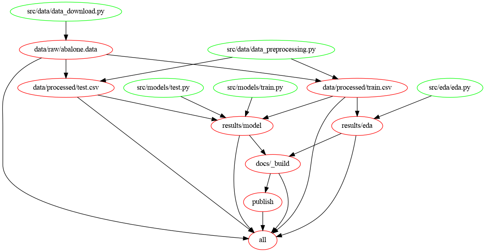

# Abalone Age Classifier

Data analysis project for DSCI 522 (Data Science workflows); a course in the Master of Data Science program at the University of British Columbia.

## Authors
- Nick Lisheng Mao
- Beilin Wu (Lynn)
- Kiran Phaterpekar
- Rakesh Pandey


## Introduction
Abalones are endangered marine snails that are found in the cold coastal water around the world. The price of an abalone is positively associated with its age. However, determining how old an abalone is a very complex process. 

In this project we are classifying abalone snails into "young" and "old" according to their number of rings based on input features such as abalone's gender, height with meat in shell, weight of the shell etc.


## About Data Set and Analysis

The Abalone data set that was used in this project was sourced from the UC Irvine Machine Learning Repository published in 1995. It can be found here. Each row in the data set represents the attributes and physical measurements of abalones including number of rings, sex, length, diameter, height, weight, etc. The number of rings were counted manually using a microscope by the researchers. The age of an abalone is represented by its number of rings plus 1.5 as number of years lived. The data set has already removed its missing values and the range of the continuous values have been scaled for use with an ANN (by dividing by 200).

In the research paper "A Quantitative Comparison of Dystal and Backpropagation" that David Clark, Zoltan Schreter and Anthony Adams submitted to the Australian Conference on Neural Networks (ACNN'96), the original abalone data set was treated as a 3-category classification problem (grouping ring classes 1-8, 9 and 10, and 11 on). In our project, we will treat the data set as a 2-categorical classification problem (grouping ring classes less or equal to 11, and more than 11).

Here, we aim to answer one research question with a Logistic Regression classification model:

**Given the input features (sex, longest shell measurement, diameter perpendicular to length, height with meat in shell, whole weight, weight of meat, gut weight after bleeding, shell weight after being dried), is an abalone young (i.e. number of rings smaller than or equal to 11), or old (i.e. number of rings is larger than 11)?**

To perform this analysis, first, after the data download, we split the data into train set and test set, perform data wrangling, and perform EDA on the train set features to investigate the relationships between the independent variables used in our model. We then preprocess the data including scaling the numerical features and one-hot-encoding the categorical feature. Next, we fit a Logistic Regression classification model on the data set, tune hyperparameters and evaluate the best performing model on the test set. The final step is creating a full report that shares the analysis results, as structured below.


## Report

The final report can be found <a href="https://github.com/UBC-MDS/abalone_age_classification/blob/main/docs/Project_report_milestone2.ipynb" >here</a>. The final analysis report consists of the following components: summary, introduction, methods including data and analysis, results/discussion, future analysis directions/takeaway and references.

## Usage

### Option 1: Using `docker`

To run this analysis using Docker, clone/download this repository, use the command line to navigate to the root of this project on your computer, and then type the following (filling in PATH_ON_YOUR_COMPUTER with the absolute path to the root of this project on your computer).

```bash

# Clean output directories and results
docker run --rm -v /$(pwd):/home/abalone veerupandey/abalone_age_classification make -C /home/abalone clean

# Run the Analysis
# Flag `--it` is here for a purpose
docker run --rm -it -p 8000:8000 -v /$(pwd):/home/abalone veerupandey/abalone_age_classification make -C /home/abalone all
```

As a simple python webserver will be started at port 8000 to serve analysis html web page, flag `-it` will help to debug and close the session. Docker can also run in detach mode with flag `-d`.

```bash
docker run --rm -d -p 8000:8000 -v /$(pwd):/home/abalone veerupandey/abalone_age_classification make -C /home/abalone all
```

Report can be accessed in local machine by accessing [http://localhost:8000](http://localhost:8000) in any of the modern web browser.

### Option 2: Using `make`

#### Create project environment

Project `python` environment needs to be created before running the analysis. Run the command mentioned below from project root directory.

```bash
make create_env
conda activate abalone
```

**Note:** If you are on Windows, you might have to run following commands to make the `altair` and `altair_saver` work as expected.

```bash
npm install -g vega vega-cli vega-lite canvas
```

#### Run analysis end to end

To run the analysis end to end, run the following commands in a Terminal/Command Prompt from the project root directory.

```bash
make clean # to clean the analysis output files

make all # to reproduce the analysis end to end
```

`make all` publishes the report on localhost. Report can be accessed in local machine by accessing [http://localhost:8000](http://localhost:8000) in any of the modern web browser.

In case report has to be published to git pages, following command should be used in defiance of `make all`.

```bash
make clean # to clean the analysis output files

make all_git_publish # to reproduce the analysis end to end and publish to git pages
```

Individual steps can also be executed using `make` command. For example - following command runs `data_download.py` script and save the output file to disk. To see all the targets/steps, please refer the `Makefile`.

```bash
make data/raw/abalone.data
```

Please clean the target directories before invoking `make` command. `make clean` can be used to clean all the intermediate files and results.

### Option 3: Using `runner.sh` 

Python environment must be created and activated before running `runner.sh`. To create the environment, use the following command.

```bash
conda env create -f environment.yml
conda activate abalone
```

To run the analysis end to end, run the script `runner.sh` in a Terminal/Command Prompt from the project root directory as follows. Script `runner.sh` runs each individual script one at a time.

```bash
nohup bash runner.sh > runner.log &
```

Log file `runner.log` logs all the steps and can be used for debugging the script.

## Flow Chart 



## Project Structure


## Dependencies

A environment file `environment.yml` of dependencies can be found <a href="https://github.com/UBC-MDS/abalone_age_classification/blob/main/environment.yml">here</a>. As project develops, this `yaml` file is subjected to change.

## Explanatory Data Analysis
A detailed EDA report can be found <a href="https://github.com/UBC-MDS/abalone_age_classification/blob/main/src/eda/eda.ipynb" >here</a>.

## License

This dataset is licensed under a Creative Commons Attribution 4.0 International (CC BY 4.0) license. This allows for the sharing and adaptation of the datasets for any purpose, provided that the appropriate credit is given.


## References

```{bibliography} references.bib
:all:
```
